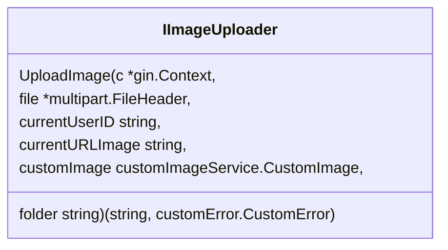

```mermaid
classDiagram

class IImageUploader {
 UploadImage(c *gin.Context,
		file *multipart.FileHeader,
		currentUserID string,
		currentURLImage string,
		customImage customImageService.CustomImage,
		folder string) (string, customError.CustomError)
}
```
