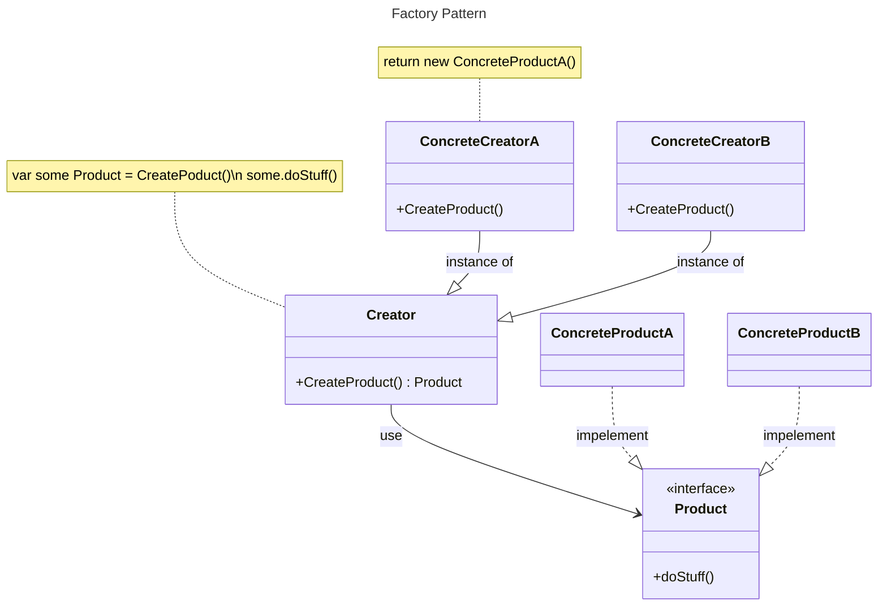

## El patorn factory aplicado a golang

No es asi nomas mira!



## Patron Factory para subir imagenes con imageUploader.go


```mermaid
---
title: Simple Factory Pattern
---
classDiagram

 note for ImageUploaderFactory "uploaderImageService, error := uploaderImage.CreateImageUploaderFactory(uploaderImage.CLOUDINARY)"
  note for ImageUploaderFactory "return new Cloudinary()"
 class ImageUploaderFactory{
 +CreateImageUploaderFactory(provider AllowedImageProvider) (ImageUploader, customError.CustomError)
 }
 
  class ImageUploader{
  +UploadImage()
  +DeleteImage()
 }
 <<interface>> ImageUploader
 
 ImageUploaderFactory --> ImageUploader : use
 
 class Cloudinary{
 +UploadImage()
  +DeleteImage()
 }  
 
 Cloudinary ..|> ImageUploader : impelement
 ```
