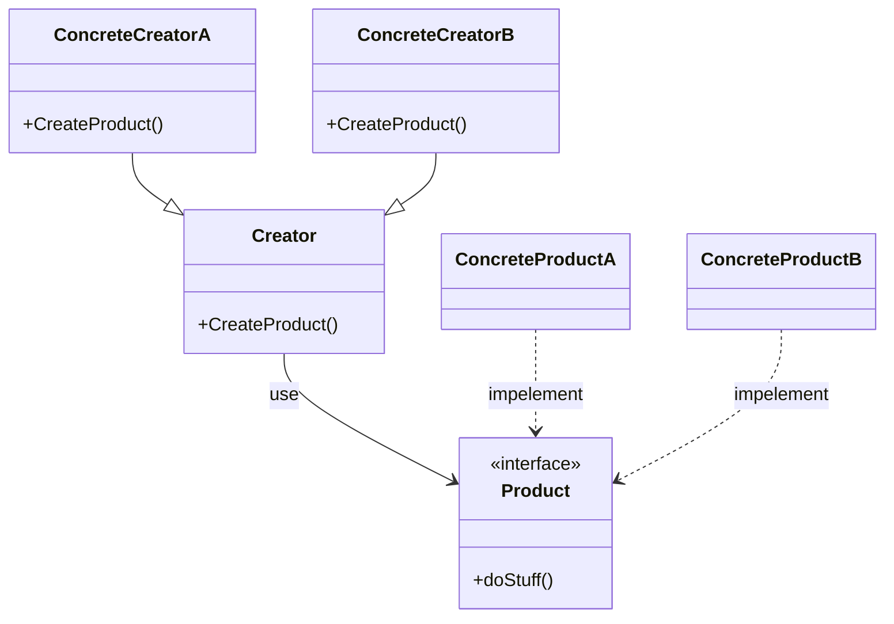

```mermaid
classDiagram
 
 class Creator{
 +CreateProduct()
 }
 
  class Product{
  +doStuff()
 }
 <<interface>> Product
 
 Creator --> Product : use
 
 class ConcreteProductA 
 class ConcreteProductB 
 
 ConcreteProductA ..> Product : impelement
 ConcreteProductB ..> Product : impelement
 
 class ConcreteCreatorA{
 +CreateProduct()
 }
 
  class ConcreteCreatorB{
 +CreateProduct()
 }
 
 ConcreteCreatorA --|> Creator
 ConcreteCreatorB --|> Creator

 
```
